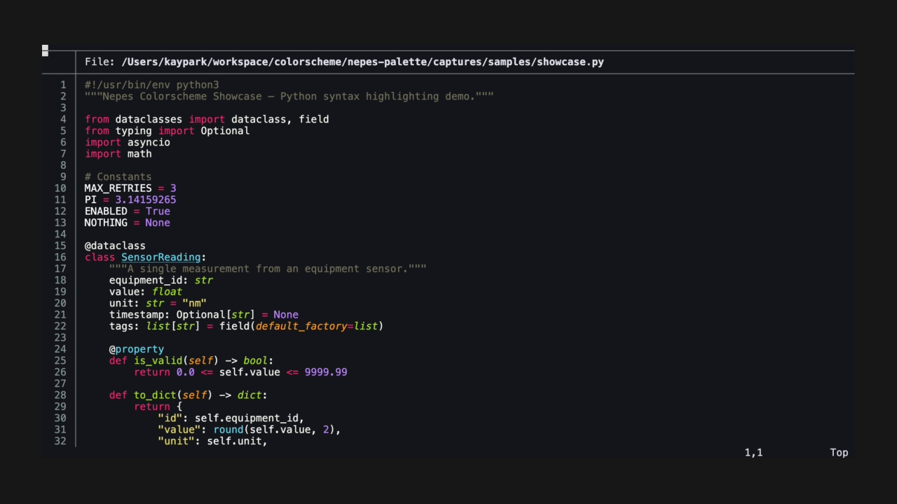

#+title: bat-nepes
#+description: Nepes color theme for bat

Syntax highlighting for cat replacement.

Part of the [[https://github.com/kayspark][Nepes Colorscheme]] suite.

* Screenshots

| Dark | Light |
|------+-------|
| [[file:docs/dark.png]] |  |

* Installation

1. Clone this repo
2. Copy =nepes-dark.tmTheme= and =nepes-light.tmTheme= to =~/.config/bat/themes/=
3. Run =bat cache --build=
4. Set theme: =export BAT_THEME="Nepes Dark"=

* Configuration

#+begin_src shell
export BAT_THEME="Nepes Dark"  # or "Nepes Light"
#+end_src

* Credits

Generated by [[https://github.com/kayspark/nepes-palette][nepes-palette]].
